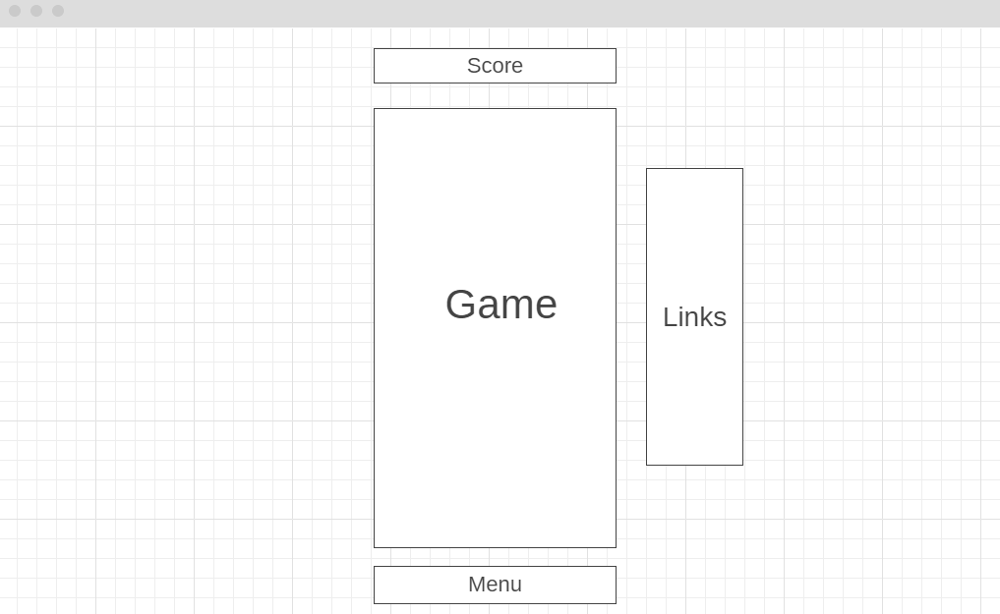

# Pixel-Jump

## Background and Overview

Pixel Jump is a game inspired by Doodle Jump. The player controls a continuously jumping object that
reaches greater heights with platforms. The higher the player goes the more score they obtain until
they fall to their demise.

## Functionality and MVPs

In Pixel Jump, there will be game logic, playable object, platforms, and high-scores that persist in
some database.

## Wireframes

## Architecture and Technologies
- Frontend
    - JavaScript, HTML/CSS
- Backend
    - Firebase

## Implementation Timeline
- Phase 1 - Day 1/2
    - File Structure
    - Understand / research JavaScript canvas
    - Write classes for entities (player object, platform, etc) and implement game physics

- Phase 2 - Day 3/4
    - Create game logic and determine when the player loses
    - Implement score, accumulated by reaching greater heights with platforms

- Phase 3 - Day 5
    - Save high-scores to database along with player name
    - Somehow increase difficulty as the player goes higher
